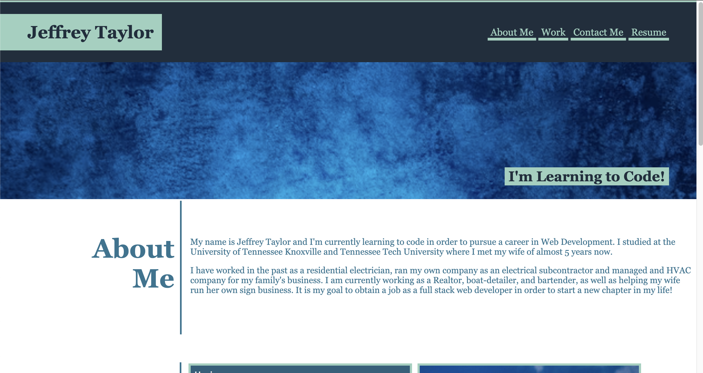

# Challenge 2: Portfolio

## Description

https://jtpheonix13.github.io/Portfolio/

This page is a basic portfolio of my bootcamp projects so far that
I will update and improve as I learn and gain better use of 
my CSS skills.

### Purpose

The purpose of this project was to use advanced CSS to build a 
page to display my projects for potential use as a resume page
for potential employers in the future and to put into use the 
html and CSS skills that i've learned so far in this course.

This page is still a work in progress and will be updated as I practice
and learn more to improve the flow and function of the page.

### Site-Screenshot

